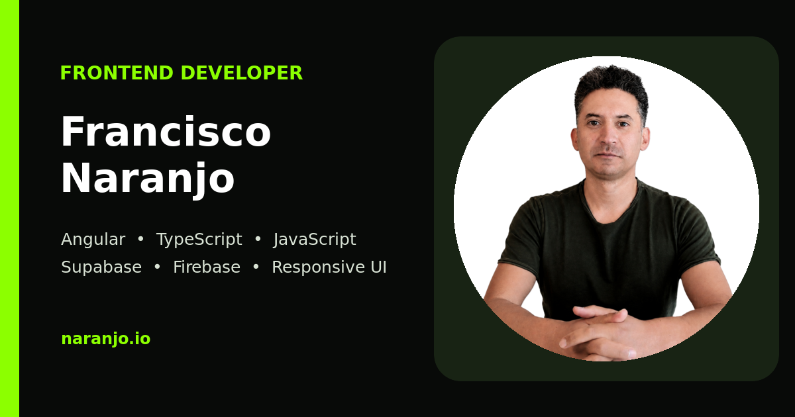
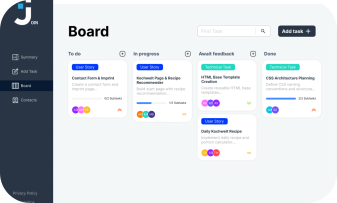
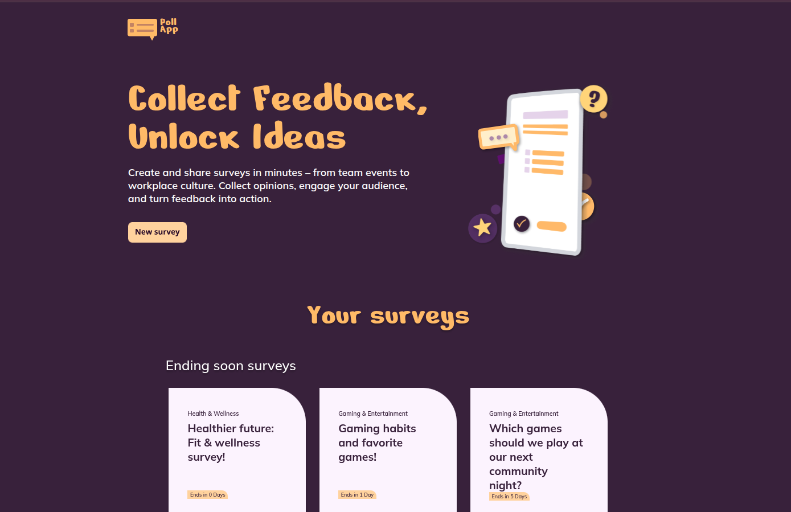

# Francisco Naranjo — Portfolio

A multilingual portfolio for **Francisco Naranjo**, frontend developer, featuring selected web projects, skills, references, and a localized contact experience.

<p align="center">
  <a href="https://naranjo.io/">
    
  </a>
</p>

<p align="center">
  <a href="https://naranjo.io/"><strong>Visit the live portfolio</strong></a>
  ·
  <a href="https://naranjo.io/en/">English</a>
  ·
  <a href="https://naranjo.io/de/">Deutsch</a>
  ·
  <a href="https://naranjo.io/es/">Español</a>
</p>

## Selected work

<table>
  <tr>
    <td width="33%" align="center">
      <br>
      <strong>Join</strong><br>
      Kanban-style task manager
    </td>
    <td width="33%" align="center">
      <br>
      <strong>Mélange à Deux</strong><br>
      Multi-page ensemble website
    </td>
    <td width="33%" align="center">
      <br>
      <strong>PollApp</strong><br>
      Survey and feedback platform
    </td>
  </tr>
</table>

The complete portfolio also presents **El Pollo Loco** and **Memory**, with expandable project cards linking to source code and live demos.

## Highlights

- Localized experiences in English, German, and Spanish
- Responsive desktop and mobile layouts
- Five expandable project presentations
- Accessible navigation and interactive UI components
- Localized contact form with client- and server-side validation
- Search metadata, structured data, canonical URLs, hreflang, sitemap, and robots directives

## Built with

- HTML5
- Modular CSS3
- Vanilla JavaScript
- PHP 8+
- JSON and Firebase in selected projects

## Repository structure

```text
.
├── index.html              # Main English entry
├── en/                     # English pages
├── de/                     # German pages
├── es/                     # Spanish pages
├── css/                    # Section and responsive styles
├── js/                     # Navigation, localization, UI, and form logic
├── assets/                 # Images, project previews, icons, and favicons
├── contact_form_mail.php   # Contact form endpoint
├── robots.txt
└── sitemap.xml
```

## Run locally

Because the contact form uses a PHP endpoint, serve the project with PHP instead of opening the HTML files directly:

```bash
php -S localhost:8000
```

Open [http://localhost:8000/](http://localhost:8000/). The other localized routes are available at `/en/`, `/de/`, and `/es/`.

On `localhost` and `127.0.0.1`, contact-form submission is simulated intentionally, so local UI testing does not send email.

## Production

The production site is hosted at [naranjo.io](https://naranjo.io/). The hosting environment must support PHP `mail()` or the endpoint must be adapted to an SMTP or email API provider.

## License

No license is currently provided. All rights reserved.
